# Requirements-to-Code Multi-Agent System
## Architecture Design Document

**Version:** 1.1  
**Status:** Draft - Pending Approval  
**Author:** Tabrez Shaik  
**Date:** February 4, 2026  
**Target Client:** Banking / Financial Services  
**Reference Implementation:** [Project Agora](https://github.com/MohitBhimrajka/project-agora)

---

## Table of Contents

1. [Executive Summary](#1-executive-summary)
2. [Problem Statement](#2-problem-statement)
3. [Goals and Non-Goals](#3-goals-and-non-goals)
4. [System Architecture](#4-system-architecture)
5. [Implementation Deep Dive](#5-implementation-deep-dive)
   - 5.1 Document Processing Pipeline
   - 5.2 Embedding & Vector Storage
   - 5.3 RAG Architecture (Vertex AI)
   - 5.4 Requirement Analysis & Decision Logic
   - 5.5 Clarification Decision Flow
   - 5.6 End-to-End Processing Flow
   - 5.7 Risk Analysis & Compliance (Banking)
   - 5.8 Availability & Resilience Requirements (Banking)
6. [Agent Specifications](#6-agent-specifications)
7. [State Machine and Workflow](#7-state-machine-and-workflow)
8. [Data Models](#8-data-models)
9. [Tools and Integrations](#9-tools-and-integrations)
10. [Technology Stack](#10-technology-stack)
11. [Security Considerations](#11-security-considerations)
12. [Deployment Architecture](#12-deployment-architecture)
13. [Implementation Roadmap](#13-implementation-roadmap)
14. [Appendices](#14-appendices)

---

## 1. Executive Summary

### 1.1 Overview

This document describes the architecture for a **multi-agent AI system** that transforms requirement documents into working, executable code. The system leverages Google's Agent Development Kit (ADK) and Gemini LLM to create a hierarchical agent topology where specialized agents collaborate through a central orchestrator.

### 1.2 Key Capabilities

| Capability | Description |
|------------|-------------|
| **Document Ingestion** | Parse requirements from PDF, Markdown, and text documents |
| **Intelligent Clarification** | Ask targeted questions to resolve ambiguities |
| **Architecture Design** | Generate system architecture with visual diagrams |
| **Code Generation** | Produce complete, multi-file project code |
| **Automated Execution** | Run generated code in sandboxed environments |
| **Quality Assurance** | Review code against best practices before delivery |

### 1.3 Technology Foundation

- **Multi-Agent Framework:** Google Agent Development Kit (ADK)
- **Large Language Model:** Google Gemini 2.5 Flash/Pro
- **Cloud Platform:** Google Cloud Platform (GCP)
- **Execution Environment:** Local subprocess (POC) / Cloud Run Jobs (production)

---

## 2. Problem Statement

### 2.1 Current Challenges

Converting requirements into working software involves multiple cognitive tasks:

1. **Understanding Requirements:** Parsing natural language documents with varying formats and levels of detail
2. **Handling Ambiguity:** Identifying unclear specifications and gathering clarifications
3. **Designing Architecture:** Making appropriate technology and structural decisions
4. **Writing Code:** Implementing the design with correct syntax, patterns, and best practices
5. **Validating Output:** Ensuring the code compiles, runs, and meets requirements

### 2.2 Why Multi-Agent?

A single LLM prompt cannot reliably handle this end-to-end workflow because:

- **Context Limitations:** The combined context of requirements + architecture + code exceeds practical limits
- **Specialization:** Different tasks require different prompting strategies and expertise
- **Quality Control:** Separation of concerns enables validation checkpoints
- **Error Recovery:** Isolated agents can retry without losing global state

### 2.3 Success Criteria

| Criterion | Target |
|-----------|--------|
| Requirement extraction accuracy | > 90% of explicit requirements captured |
| Clarification relevance | > 85% of questions address genuine ambiguities |
| Code compilation rate | 100% (generated code must compile) |
| Code execution rate | > 90% for well-specified requirements |
| End-to-end latency | < 5 minutes for simple projects |

---

## 3. Goals and Non-Goals

### 3.1 Goals

**G1. Automated Requirements Processing**
- Accept requirements in multiple formats (PDF, Markdown, plain text)
- Extract structured requirements from unstructured documents
- Identify and flag ambiguities automatically

**G2. Interactive Clarification**
- Generate targeted questions for unclear requirements
- Support multi-turn clarification dialogues
- Track which requirements have been clarified

**G3. Architecture Generation**
- Design appropriate system architecture based on requirements
- Produce visual diagrams (Mermaid/PNG)
- Recommend technology stacks

**G4. Code Generation**
- Generate complete, runnable projects (not just snippets)
- Support multiple programming languages (Python primary, others secondary)
- Include configuration files, dependencies, and documentation

**G5. Code Execution**
- Execute generated code in isolated environments
- Capture and report execution results
- Handle common runtime errors gracefully

**G6. Human-in-the-Loop**
- Require user approval at critical decision points
- Allow users to modify generated artifacts
- Support iterative refinement

### 3.2 Non-Goals (for POC)

- **Production deployment** - This is a proof-of-concept
- **Multi-language parity** - Python is primary; other languages are best-effort
- **Complex distributed systems** - Focus on single-service applications
- **Persistent learning** - No fine-tuning or memory across sessions
- **Real-time collaboration** - Single user at a time
- **Integration with existing codebases** - Greenfield projects only

---

## 4. System Architecture

### 4.1 High-Level Architecture

```
┌─────────────────────────────────────────────────────────────────────────────┐
│                              USER INTERFACE                                  │
│                    (ADK Web UI / CLI / Custom Frontend)                     │
└─────────────────────────────────────────────────────────────────────────────┘
                                      │
                                      ▼
┌─────────────────────────────────────────────────────────────────────────────┐
│                           ORCHESTRATOR AGENT                                 │
│  ┌─────────────────┐  ┌─────────────────┐  ┌─────────────────┐             │
│  │  State Machine  │  │  Session State  │  │  Error Handler  │             │
│  │    Controller   │  │    Manager      │  │                 │             │
│  └─────────────────┘  └─────────────────┘  └─────────────────┘             │
└─────────────────────────────────────────────────────────────────────────────┘
          │                    │                    │                    │
          ▼                    ▼                    ▼                    ▼
┌──────────────┐    ┌──────────────┐    ┌──────────────┐    ┌──────────────┐
│ Requirements │    │ Clarification│    │ Architecture │    │    Code      │
│    Parser    │    │    Agent     │    │   Designer   │    │  Generator   │
│    Agent     │    │              │    │    Agent     │    │    Agent     │
└──────────────┘    └──────────────┘    └──────────────┘    └──────────────┘
                                                                    │
                                              ┌─────────────────────┴────────┐
                                              ▼                              ▼
                                    ┌──────────────┐              ┌──────────────┐
                                    │    Code      │              │    Code      │
                                    │   Reviewer   │              │   Executor   │
                                    │    Agent     │              │    Agent     │
                                    └──────────────┘              └──────────────┘
```

### 4.2 Agent Topology Diagram

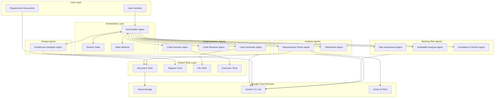

### 4.3 Data Flow Diagram

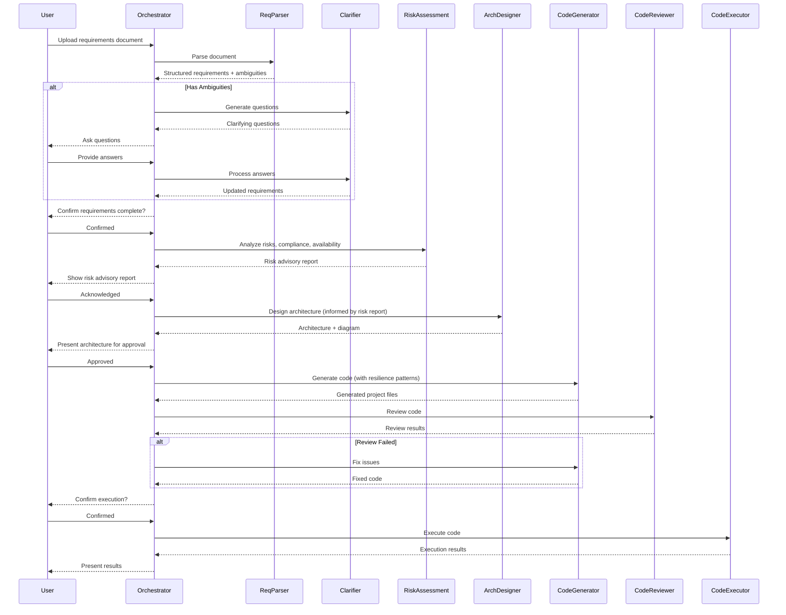

### 4.4 Component Interaction Model

Each specialist agent is wrapped as an `AgentTool` and invoked by the orchestrator:

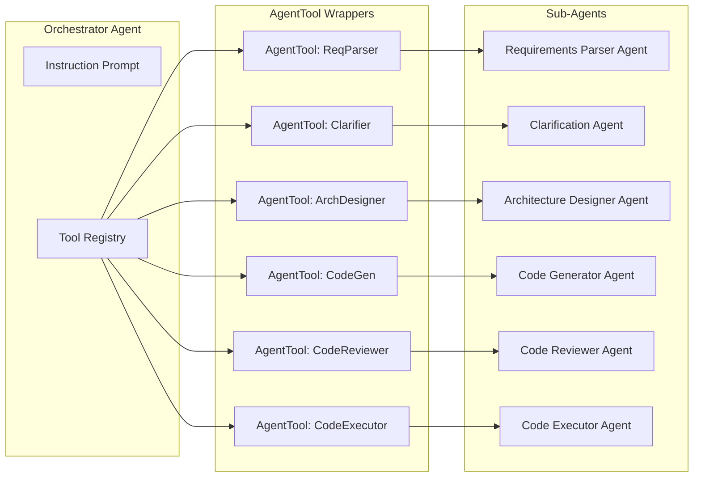

---

## 5. Implementation Deep Dive

This section provides detailed technical specifications for how each component works, following patterns from Google's ADK ecosystem (reference: [Project Agora](https://github.com/MohitBhimrajka/project-agora)).

### 5.1 Document Processing Pipeline

The system accepts requirement documents and processes them through a multi-stage pipeline:

```
┌──────────────────────────────────────────────────────────────────────────────┐
│                        DOCUMENT PROCESSING PIPELINE                           │
└──────────────────────────────────────────────────────────────────────────────┘

  ┌─────────────┐    ┌─────────────┐    ┌─────────────┐    ┌─────────────┐
  │   INGEST    │───▶│   EXTRACT   │───▶│   CHUNK     │───▶│   EMBED     │
  │             │    │             │    │             │    │             │
  │ PDF/MD/TXT  │    │ Text Content│    │ Semantic    │    │ Vector      │
  │ from GCS    │    │ + Structure │    │ Segments    │    │ Embeddings  │
  └─────────────┘    └─────────────┘    └─────────────┘    └─────────────┘
                                                                  │
                                                                  ▼
  ┌─────────────┐    ┌─────────────┐    ┌─────────────────────────────────┐
  │   ANALYZE   │◀───│   STORE     │◀───│        VERTEX AI RAG            │
  │             │    │             │    │                                 │
  │ Requirement │    │ RAG Corpus  │    │ - Corpus creation              │
  │ Extraction  │    │ + BigQuery  │    │ - Document import              │
  └─────────────┘    └─────────────┘    │ - Index building               │
                                        └─────────────────────────────────┘
```

#### Step 1: Document Ingestion

**Input Sources:**
- Google Cloud Storage (GCS) URI: `gs://bucket-name/requirements.pdf`
- Direct text upload via API
- Markdown files with structured sections

**Implementation:**
```python
from google.cloud import storage

def read_document_from_gcs(uri: str) -> str:
    """
    Reads a document from Google Cloud Storage.
    
    Args:
        uri: GCS URI in format gs://bucket/path/to/file
        
    Returns:
        Document content as string
    """
    # Parse the GCS URI
    # gs://bucket-name/path/to/file.pdf
    bucket_name = uri.split('/')[2]
    blob_path = '/'.join(uri.split('/')[3:])
    
    client = storage.Client()
    bucket = client.bucket(bucket_name)
    blob = bucket.blob(blob_path)
    
    content = blob.download_as_bytes()
    
    # Route to appropriate parser based on file extension
    if uri.endswith('.pdf'):
        return parse_pdf(content)
    elif uri.endswith('.md'):
        return parse_markdown(content.decode('utf-8'))
    else:
        return content.decode('utf-8')
```

#### Step 2: Content Extraction

**PDF Processing:**
```python
from pypdf import PdfReader
from io import BytesIO

def parse_pdf(content: bytes) -> str:
    """Extract text from PDF maintaining structure."""
    reader = PdfReader(BytesIO(content))
    
    extracted_text = []
    for page_num, page in enumerate(reader.pages):
        text = page.extract_text()
        extracted_text.append(f"[Page {page_num + 1}]\n{text}")
    
    return '\n\n'.join(extracted_text)
```

**Markdown Processing:**
```python
import markdown_it

def parse_markdown(content: str) -> dict:
    """Parse markdown into structured sections."""
    md = markdown_it.MarkdownIt()
    tokens = md.parse(content)
    
    sections = []
    current_section = None
    
    for token in tokens:
        if token.type == 'heading_open':
            if current_section:
                sections.append(current_section)
            current_section = {'level': int(token.tag[1]), 'title': '', 'content': ''}
        elif token.type == 'inline' and current_section:
            if not current_section['title']:
                current_section['title'] = token.content
            else:
                current_section['content'] += token.content
    
    return {'sections': sections, 'raw': content}
```

#### Step 3: Semantic Chunking

Documents are split into semantic chunks for embedding:

```python
def chunk_document(text: str, chunk_size: int = 1024, overlap: int = 128) -> list[dict]:
    """
    Split document into overlapping chunks for embedding.
    
    Args:
        text: Full document text
        chunk_size: Target characters per chunk (1024 recommended for technical docs)
        overlap: Characters to overlap between chunks
        
    Returns:
        List of chunk dictionaries with metadata
    """
    chunks = []
    start = 0
    chunk_id = 0
    
    while start < len(text):
        end = start + chunk_size
        
        # Try to break at sentence boundary
        if end < len(text):
            # Look for sentence end within last 100 chars
            for i in range(min(100, end - start)):
                if text[end - i] in '.!?\n':
                    end = end - i + 1
                    break
        
        chunk_text = text[start:end].strip()
        
        if chunk_text:
            chunks.append({
                'chunk_id': f'chunk_{chunk_id}',
                'text': chunk_text,
                'start_char': start,
                'end_char': end,
                'char_count': len(chunk_text)
            })
            chunk_id += 1
        
        start = end - overlap
    
    return chunks
```

---

### 5.2 Embedding & Vector Storage

#### Embedding Model

We use **Vertex AI's `text-embedding-004`** model (768 dimensions):

```python
from vertexai.language_models import TextEmbeddingModel

def get_embedding(text: str, model_name: str = "text-embedding-004") -> list[float]:
    """
    Generate vector embedding for text using Vertex AI.
    
    Args:
        text: Text to embed
        model_name: Vertex AI embedding model
        
    Returns:
        768-dimensional float vector
    """
    model = TextEmbeddingModel.from_pretrained(model_name)
    
    try:
        embeddings = model.get_embeddings([text])
        return embeddings[0].values  # Returns list of 768 floats
    except Exception as e:
        print(f"ERROR: Could not get embedding: {e}")
        # Return zero vector on failure (768 dimensions)
        return [0.0] * 768
```

#### Vector Storage Options

**Option A: Vertex AI RAG Corpus (Recommended)**

```python
from vertexai.preview import rag

# Create RAG Corpus
corpus = rag.create_corpus(
    display_name="requirements-knowledge-base",
    description="Knowledge base for requirement documents"
)

# Import documents
rag.import_files(
    corpus_name=corpus.name,
    paths=["gs://bucket/requirements/"],  # GCS path
    chunk_size=1024,
    chunk_overlap=128
)

# The corpus name is saved for later retrieval
# Format: projects/{project}/locations/{location}/ragCorpora/{corpus_id}
```

**Option B: BigQuery Vector Search (For historical data)**

```sql
-- Table schema for storing requirements with embeddings
CREATE TABLE `project.dataset.requirements` (
    requirement_id STRING,
    project_id STRING,
    description STRING,
    category STRING,
    priority STRING,
    embedding ARRAY<FLOAT64>,  -- 768-dimensional vector
    created_at TIMESTAMP
);
```

```python
from google.cloud import bigquery

def store_requirement_embedding(requirement: dict, embedding: list[float]):
    """Store requirement with its embedding in BigQuery."""
    client = bigquery.Client()
    
    table_id = "project.dataset.requirements"
    
    row = {
        "requirement_id": requirement['id'],
        "project_id": requirement['project_id'],
        "description": requirement['description'],
        "category": requirement['category'],
        "priority": requirement['priority'],
        "embedding": embedding,
        "created_at": datetime.utcnow().isoformat()
    }
    
    errors = client.insert_rows_json(table_id, [row])
    if errors:
        raise Exception(f"Failed to insert: {errors}")
```

---

### 5.3 RAG Architecture (Vertex AI)

Following Google ADK patterns, we use **VertexAiRagRetrieval** for knowledge retrieval:

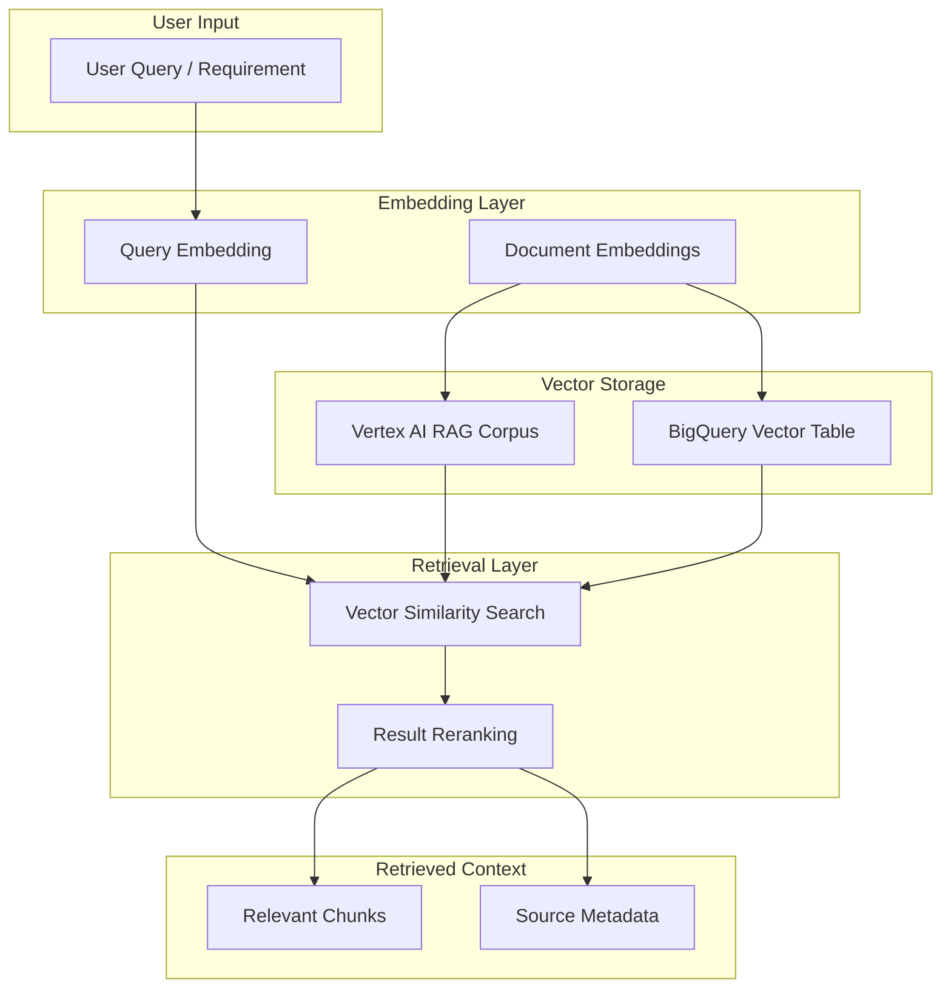

#### RAG Tool Implementation

```python
from google.adk.tools.retrieval import VertexAiRagRetrieval
from vertexai.preview import rag
import os

# Load corpus name from environment
RAG_CORPUS_RESOURCE_NAME = os.getenv("RAG_CORPUS_NAME")

# Create the RAG retrieval tool
search_knowledge_base = VertexAiRagRetrieval(
    name="search_requirements_knowledge_base",
    description="Searches the requirements knowledge base for relevant information.",
    rag_resources=[
        rag.RagResource(rag_corpus=RAG_CORPUS_RESOURCE_NAME)
    ],
    similarity_top_k=5,           # Return top 5 matches
    vector_distance_threshold=0.5  # Cosine distance threshold
)
```

#### BigQuery Vector Search Implementation

For searching historical requirements/solutions:

```python
def search_similar_requirements(query: str) -> list[dict]:
    """
    Performs semantic vector search on BigQuery.
    
    Args:
        query: Search query text
        
    Returns:
        Top 3 most similar requirements
    """
    # Get embedding for the query
    query_embedding = get_embedding(query)
    
    client = bigquery.Client()
    
    sql_query = """
        SELECT
            requirement_id,
            description,
            category,
            priority,
            -- Calculate cosine distance (lower = more similar)
            COSINE_DISTANCE(embedding, @query_embedding) as distance
        FROM
            `project.dataset.requirements`
        ORDER BY
            distance ASC
        LIMIT 3
    """
    
    job_config = bigquery.QueryJobConfig(
        query_parameters=[
            bigquery.ArrayQueryParameter(
                "query_embedding", 
                "FLOAT64", 
                query_embedding
            ),
        ]
    )
    
    results = client.query(sql_query, job_config=job_config)
    return [dict(row) for row in results]
```

---

### 5.4 Requirement Analysis & Decision Logic

The **Requirements Parser Agent** analyzes documents and determines:
1. What are the explicit requirements?
2. What is ambiguous or unclear?
3. Is clarification needed?

#### Analysis Process

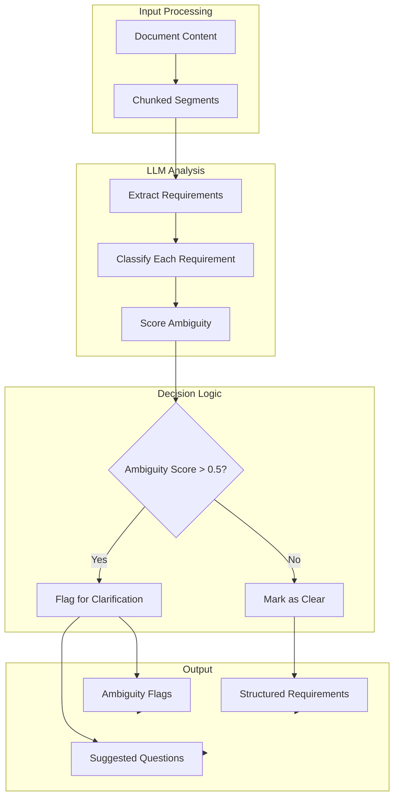

#### Ambiguity Detection Logic

The LLM evaluates each requirement against these criteria:

| Ambiguity Indicator | Example | Score Impact |
|---------------------|---------|--------------|
| **Vague quantifiers** | "handle many users" | +0.3 |
| **Missing specifics** | "secure authentication" (no method) | +0.4 |
| **Undefined terms** | "fast response time" (no metric) | +0.3 |
| **Multiple interpretations** | "user-friendly interface" | +0.2 |
| **Implicit assumptions** | "standard deployment" | +0.2 |
| **Conflicting requirements** | Contradictory statements | +0.5 |

**Scoring Formula:**
```
ambiguity_score = min(1.0, sum(indicator_scores))

if ambiguity_score > 0.5:
    needs_clarification = True
else:
    needs_clarification = False
```

#### Prompt for Requirement Analysis

```python
REQUIREMENT_ANALYSIS_PROMPT = """
You are a Requirements Analyst Agent. Your task is to extract and analyze 
requirements from the provided document.

For EACH requirement you identify:

1. **Extract** the requirement statement
2. **Classify** as FUNCTIONAL or NON_FUNCTIONAL
3. **Categorize** (authentication, data, ui, api, performance, security, etc.)
4. **Assign Priority** using MoSCoW (Must/Should/Could/Won't) based on language cues
5. **Score Ambiguity** from 0.0 (perfectly clear) to 1.0 (very ambiguous)
6. **Explain** why it's ambiguous (if score > 0.3)
7. **Suggest** a clarifying question (if score > 0.5)

**Ambiguity Indicators to Check:**
- Vague quantifiers (many, few, fast, slow)
- Missing technical specifics (which protocol? what format?)
- Undefined success criteria (how do we know it works?)
- Multiple possible interpretations
- Implicit assumptions

**Output Format (JSON):**
{
  "requirements": [
    {
      "id": "REQ-001",
      "type": "FUNCTIONAL",
      "category": "authentication",
      "description": "...",
      "priority": "MUST",
      "ambiguity_score": 0.7,
      "ambiguity_reason": "Authentication method not specified",
      "suggested_question": "Which authentication method should be used: OAuth2, JWT, or session-based?"
    }
  ],
  "summary": {
    "total": 8,
    "functional": 5,
    "non_functional": 3,
    "needs_clarification": 2
  }
}
"""
```

---

### 5.5 Clarification Decision Flow

The system uses a **Decision Agent** pattern to determine whether clarification is needed:

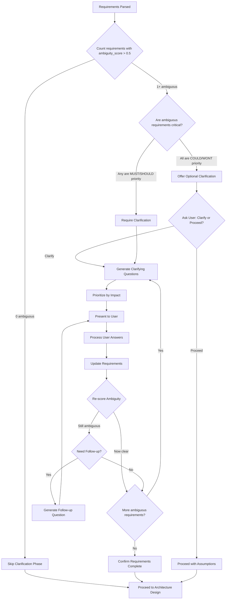

#### Decision Logic Implementation

```python
def should_require_clarification(requirements: list[dict]) -> dict:
    """
    Determines if clarification is required, optional, or not needed.
    
    Returns:
        {
            "decision": "required" | "optional" | "not_needed",
            "reason": str,
            "ambiguous_requirements": list[str],
            "critical_ambiguities": list[str]
        }
    """
    ambiguous = [r for r in requirements if r['ambiguity_score'] > 0.5]
    critical_priorities = {'MUST', 'SHOULD'}
    
    if not ambiguous:
        return {
            "decision": "not_needed",
            "reason": "All requirements are sufficiently clear",
            "ambiguous_requirements": [],
            "critical_ambiguities": []
        }
    
    critical_ambiguous = [
        r for r in ambiguous 
        if r['priority'] in critical_priorities
    ]
    
    if critical_ambiguous:
        return {
            "decision": "required",
            "reason": f"{len(critical_ambiguous)} critical requirements need clarification",
            "ambiguous_requirements": [r['id'] for r in ambiguous],
            "critical_ambiguities": [r['id'] for r in critical_ambiguous]
        }
    else:
        return {
            "decision": "optional",
            "reason": "Ambiguous requirements are low priority - clarification recommended but not required",
            "ambiguous_requirements": [r['id'] for r in ambiguous],
            "critical_ambiguities": []
        }
```

#### Question Prioritization

Questions are prioritized by **architectural impact**:

```python
def prioritize_questions(ambiguous_requirements: list[dict]) -> list[dict]:
    """
    Prioritize clarifying questions by their impact on architecture.
    
    Priority order:
    1. Security/Authentication decisions
    2. Data model decisions
    3. Integration decisions
    4. Performance requirements
    5. UI/UX preferences
    """
    
    category_priority = {
        'authentication': 1,
        'security': 1,
        'data': 2,
        'database': 2,
        'integration': 3,
        'api': 3,
        'performance': 4,
        'scalability': 4,
        'ui': 5,
        'ux': 5
    }
    
    def get_priority(req):
        return (
            category_priority.get(req['category'], 10),
            -req['ambiguity_score'],  # Higher ambiguity = higher priority
            req['priority'] != 'MUST'  # MUST requirements first
        )
    
    sorted_reqs = sorted(ambiguous_requirements, key=get_priority)
    
    return [
        {
            "question_id": f"Q-{i+1}",
            "requirement_id": req['id'],
            "question": req['suggested_question'],
            "category": req['category'],
            "impact": "high" if get_priority(req)[0] <= 2 else "medium"
        }
        for i, req in enumerate(sorted_reqs)
    ]
```

---

### 5.6 End-to-End Processing Flow

Here's the complete flow from document upload to code execution:

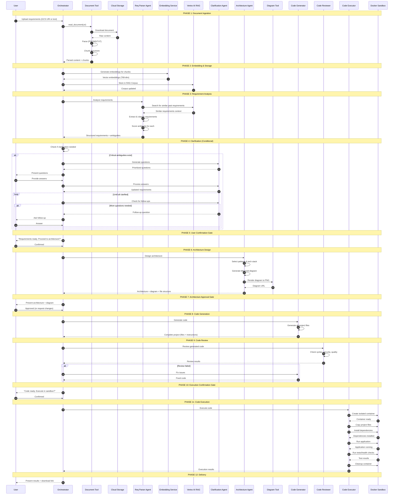

#### State Transitions Summary

| Phase | State Before | Agent/Tool | State After | User Gate? |
|-------|--------------|------------|-------------|------------|
| 1 | `NEW` | Document Tool | `PARSING` | No |
| 2 | `PARSING` | Embedding Service | `PARSING` | No |
| 3 | `PARSING` | Req Parser Agent | `ANALYZING` | No |
| 4 | `ANALYZING` | Clarification Agent | `CLARIFYING` | No |
| 5 | `CLARIFYING` | - | `AWAITING_REQ_CONFIRM` | **YES** |
| 6 | `CONFIRMED` | Architecture Agent | `DESIGNING` | No |
| 7 | `DESIGNING` | - | `AWAITING_ARCH_APPROVE` | **YES** |
| 8 | `APPROVED` | Code Generator | `GENERATING` | No |
| 9 | `GENERATING` | Code Reviewer | `REVIEWING` | No |
| 10 | `REVIEWED` | - | `AWAITING_EXEC_CONFIRM` | **YES** |
| 11 | `EXEC_CONFIRMED` | Code Executor | `EXECUTING` | No |
| 12 | `EXECUTING` | - | `COMPLETE` | No |

---

### 5.7 Risk Analysis & Compliance (Banking)

Since the target client is a **bank**, the system must incorporate comprehensive risk analysis and regulatory compliance checks. This is implemented as an **advisory layer** that generates a risk report without blocking the workflow.

#### Risk Analysis Architecture

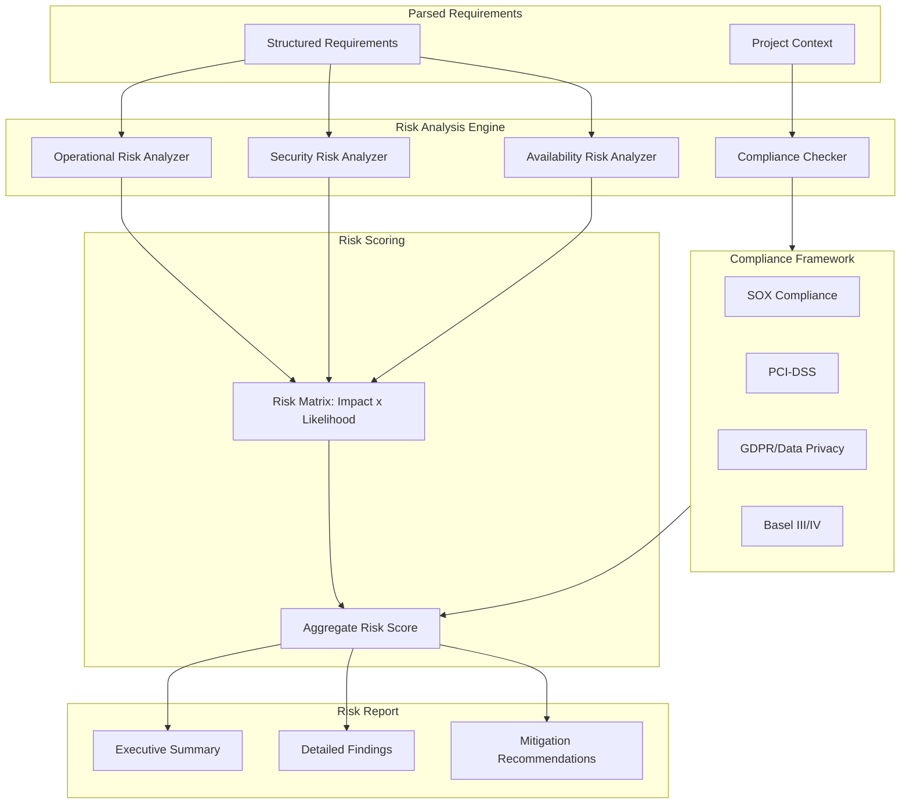

#### Core Risk Categories

| Risk Category | Description | Banking Relevance |
|---------------|-------------|-------------------|
| **Operational Risk** | Risks from inadequate processes, systems, or human error | Core banking operations, transaction processing |
| **Security Risk** | Threats to data confidentiality, integrity, availability | Customer data, financial transactions, fraud prevention |
| **Availability Risk** | Service downtime, performance degradation | 24/7 banking services, SLA compliance |

#### Risk Scoring Matrix

Each requirement is scored on two dimensions:

**Impact Level:**
| Level | Score | Description | Example |
|-------|-------|-------------|---------|
| Critical | 5 | System-wide failure, regulatory breach | Core banking system down |
| High | 4 | Major service disruption, data breach | Payment processing failure |
| Medium | 3 | Significant degradation, partial outage | Report generation delayed |
| Low | 2 | Minor inconvenience, workaround available | UI glitch |
| Minimal | 1 | Cosmetic, no business impact | Color preference |

**Likelihood Level:**
| Level | Score | Description |
|-------|-------|-------------|
| Almost Certain | 5 | >90% probability |
| Likely | 4 | 60-90% probability |
| Possible | 3 | 30-60% probability |
| Unlikely | 2 | 10-30% probability |
| Rare | 1 | <10% probability |

**Risk Score Calculation:**
```
Risk Score = Impact × Likelihood

Risk Level:
- CRITICAL: Score ≥ 20 (e.g., 5×4, 4×5)
- HIGH:     Score 12-19
- MEDIUM:   Score 6-11
- LOW:      Score 1-5
```

#### Risk Assessment Agent

```python
from google.adk.agents import Agent

RISK_ASSESSMENT_PROMPT = """
You are a Risk Assessment Agent specialized in banking and financial services.

Your role is to analyze requirements and identify risks across three categories:

1. **OPERATIONAL RISK**
   - Process failures or gaps
   - Human error potential
   - Third-party dependencies
   - Data quality issues
   - Business continuity concerns

2. **SECURITY RISK**
   - Data exposure potential
   - Authentication/authorization gaps
   - Encryption requirements
   - Audit trail adequacy
   - Fraud vulnerability

3. **AVAILABILITY RISK**
   - Single points of failure
   - Scalability limitations
   - Recovery time objectives (RTO)
   - Recovery point objectives (RPO)
   - Performance bottlenecks

For EACH requirement, output:
{
  "requirement_id": "REQ-001",
  "risk_assessment": {
    "operational": {
      "identified_risks": ["..."],
      "impact": 1-5,
      "likelihood": 1-5,
      "score": impact × likelihood,
      "mitigation": "..."
    },
    "security": { ... },
    "availability": { ... }
  },
  "overall_risk_level": "CRITICAL|HIGH|MEDIUM|LOW",
  "requires_review": true/false
}
"""

risk_assessment_agent = Agent(
    name="risk_assessment_agent",
    model="gemini-2.5-pro",  # Higher capability for risk analysis
    instruction=RISK_ASSESSMENT_PROMPT,
    output_key="risk_assessment_results"
)
```

#### Compliance Checker

The system checks requirements against major regulatory frameworks:

```python
COMPLIANCE_FRAMEWORKS = {
    "SOX": {
        "name": "Sarbanes-Oxley Act",
        "checks": [
            "audit_trail_required",
            "access_controls_defined",
            "data_integrity_measures",
            "change_management_process",
            "segregation_of_duties"
        ],
        "applies_to": ["financial_reporting", "internal_controls", "audit"]
    },
    "PCI_DSS": {
        "name": "Payment Card Industry Data Security Standard",
        "checks": [
            "cardholder_data_encryption",
            "network_segmentation",
            "access_logging",
            "vulnerability_management",
            "secure_transmission"
        ],
        "applies_to": ["payment", "card_data", "transaction"]
    },
    "GDPR": {
        "name": "General Data Protection Regulation",
        "checks": [
            "consent_mechanism",
            "data_minimization",
            "right_to_erasure",
            "data_portability",
            "breach_notification"
        ],
        "applies_to": ["personal_data", "customer_data", "user_information"]
    },
    "BASEL_III": {
        "name": "Basel III Banking Regulations",
        "checks": [
            "capital_adequacy_reporting",
            "liquidity_monitoring",
            "leverage_ratio_tracking",
            "risk_exposure_limits"
        ],
        "applies_to": ["capital", "liquidity", "risk_management"]
    }
}

def check_compliance(requirements: list[dict]) -> dict:
    """
    Check requirements against applicable compliance frameworks.
    
    Returns:
        {
            "applicable_frameworks": ["SOX", "PCI_DSS"],
            "compliance_gaps": [
                {
                    "framework": "PCI_DSS",
                    "requirement": "REQ-003",
                    "missing_control": "cardholder_data_encryption",
                    "recommendation": "Add encryption for card data at rest and in transit"
                }
            ],
            "compliant_items": [...],
            "review_required": true/false
        }
    """
    results = {
        "applicable_frameworks": [],
        "compliance_gaps": [],
        "compliant_items": [],
        "review_required": False
    }
    
    for req in requirements:
        # Determine applicable frameworks based on requirement category
        applicable = determine_applicable_frameworks(req)
        results["applicable_frameworks"].extend(applicable)
        
        for framework_id in applicable:
            framework = COMPLIANCE_FRAMEWORKS[framework_id]
            gaps = check_framework_compliance(req, framework)
            
            if gaps:
                results["compliance_gaps"].extend(gaps)
                results["review_required"] = True
            else:
                results["compliant_items"].append({
                    "requirement": req["id"],
                    "framework": framework_id
                })
    
    results["applicable_frameworks"] = list(set(results["applicable_frameworks"]))
    return results
```

#### Risk Report Output

The Risk Assessment Agent generates an advisory report:

```json
{
  "report_id": "RISK-2026-02-04-001",
  "generated_at": "2026-02-04T14:30:00Z",
  "project_name": "Payment Gateway Enhancement",
  
  "executive_summary": {
    "total_requirements": 15,
    "risk_distribution": {
      "CRITICAL": 1,
      "HIGH": 3,
      "MEDIUM": 6,
      "LOW": 5
    },
    "overall_risk_level": "HIGH",
    "recommendation": "Proceed with enhanced security controls"
  },
  
  "risk_findings": [
    {
      "requirement_id": "REQ-003",
      "requirement": "Process credit card payments",
      "risk_level": "CRITICAL",
      "category": "security",
      "finding": "Card data handling requires PCI-DSS compliance",
      "impact": 5,
      "likelihood": 4,
      "score": 20,
      "mitigation": [
        "Implement tokenization for card numbers",
        "Use PCI-compliant payment processor",
        "Add end-to-end encryption"
      ]
    }
  ],
  
  "compliance_status": {
    "frameworks_checked": ["SOX", "PCI_DSS", "GDPR"],
    "gaps_found": 2,
    "gaps": [
      {
        "framework": "PCI_DSS",
        "control": "cardholder_data_encryption",
        "status": "MISSING",
        "remediation": "Implement AES-256 encryption for stored card data"
      }
    ]
  },
  
  "availability_assessment": {
    "sla_requirements_identified": true,
    "target_availability": "99.99%",
    "single_points_of_failure": ["database connection"],
    "recommended_architecture": "Active-active with failover"
  },
  
  "advisory_notes": [
    "This is an advisory report - workflow will continue",
    "High-risk items flagged for architecture review",
    "Compliance gaps should be addressed in implementation"
  ]
}
```

#### Integration into Workflow

The Risk Analysis is integrated as an **advisory step** after requirements confirmation:

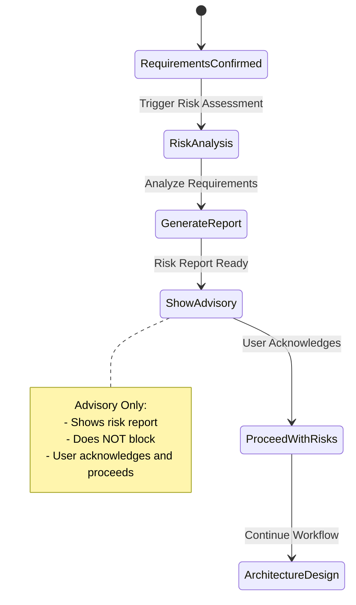

---

### 5.8 Availability & Resilience Requirements (Banking)

Banking systems require exceptional availability. The system analyzes and enforces availability requirements.

#### Availability Tiers

| Tier | Availability | Downtime/Year | Use Case |
|------|--------------|---------------|----------|
| **Tier 1** | 99.99% | 52.6 minutes | Core banking, payments |
| **Tier 2** | 99.9% | 8.76 hours | Customer-facing apps |
| **Tier 3** | 99.5% | 43.8 hours | Internal tools |
| **Tier 4** | 99% | 87.6 hours | Batch processing |

#### Availability Analysis Agent

```python
AVAILABILITY_ANALYSIS_PROMPT = """
You are an Availability Analysis Agent for banking systems.

Analyze requirements to determine:

1. **Required Availability Tier** based on:
   - Business criticality
   - Customer impact
   - Regulatory requirements
   - Revenue impact of downtime

2. **Recovery Objectives**:
   - RTO (Recovery Time Objective): Max acceptable downtime
   - RPO (Recovery Point Objective): Max acceptable data loss

3. **Architecture Implications**:
   - Redundancy requirements
   - Failover mechanisms
   - Load balancing needs
   - Geographic distribution

4. **Monitoring Requirements**:
   - Health check endpoints
   - Alerting thresholds
   - SLA tracking

Output for each requirement:
{
  "requirement_id": "REQ-001",
  "availability_analysis": {
    "recommended_tier": 1-4,
    "target_availability": "99.99%",
    "rto_minutes": 5,
    "rpo_minutes": 1,
    "justification": "...",
    "architecture_requirements": [
      "Active-active deployment",
      "Database replication",
      "Auto-scaling enabled"
    ],
    "monitoring_requirements": [
      "Health endpoint: /health",
      "Latency threshold: <200ms",
      "Error rate threshold: <0.1%"
    ]
  }
}

For banking systems, default to higher availability tiers unless 
explicitly specified otherwise.
"""

availability_analysis_agent = Agent(
    name="availability_analysis_agent",
    model="gemini-2.5-flash",
    instruction=AVAILABILITY_ANALYSIS_PROMPT,
    output_key="availability_results"
)
```

#### Resilience Patterns

The Code Generator Agent is enhanced to implement resilience patterns based on availability tier:

| Pattern | Tier 1 | Tier 2 | Tier 3 | Tier 4 |
|---------|--------|--------|--------|--------|
| **Circuit Breaker** | Required | Required | Recommended | Optional |
| **Retry with Backoff** | Required | Required | Required | Recommended |
| **Bulkhead Isolation** | Required | Recommended | Optional | Optional |
| **Health Checks** | Required | Required | Required | Required |
| **Graceful Degradation** | Required | Required | Recommended | Optional |
| **Auto-scaling** | Required | Recommended | Optional | No |
| **Multi-region** | Required | Optional | No | No |

#### Generated Code Enhancements

For high-availability requirements, the Code Generator adds:

```python
# Example: Generated FastAPI with resilience patterns

from fastapi import FastAPI, HTTPException
from circuitbreaker import circuit
from tenacity import retry, stop_after_attempt, wait_exponential
import structlog

logger = structlog.get_logger()

app = FastAPI()

# Health check endpoint (required for all tiers)
@app.get("/health")
async def health_check():
    """
    Health check endpoint for load balancer and monitoring.
    Returns service status and dependencies health.
    """
    return {
        "status": "healthy",
        "timestamp": datetime.utcnow().isoformat(),
        "dependencies": {
            "database": await check_db_health(),
            "cache": await check_cache_health()
        }
    }

# Circuit breaker for external service calls
@circuit(failure_threshold=5, recovery_timeout=30)
async def call_external_service(payload: dict):
    """
    External service call with circuit breaker.
    Opens circuit after 5 failures, attempts recovery after 30s.
    """
    # Implementation
    pass

# Retry with exponential backoff
@retry(
    stop=stop_after_attempt(3),
    wait=wait_exponential(multiplier=1, min=1, max=10)
)
async def database_operation(query: str):
    """
    Database operation with retry logic.
    Retries up to 3 times with exponential backoff.
    """
    # Implementation
    pass

# Graceful degradation example
async def get_user_data(user_id: str):
    """
    Get user data with graceful degradation.
    Falls back to cached data if primary source unavailable.
    """
    try:
        return await fetch_from_primary(user_id)
    except ServiceUnavailable:
        logger.warning("Primary unavailable, using cache", user_id=user_id)
        cached = await fetch_from_cache(user_id)
        if cached:
            return {**cached, "_source": "cache", "_stale": True}
        raise HTTPException(503, "Service temporarily unavailable")
```

#### Availability Validation

The Code Reviewer Agent includes availability checks:

```python
AVAILABILITY_REVIEW_CRITERIA = {
    "health_endpoint": {
        "check": "Has /health or /healthz endpoint",
        "severity": "BLOCKING",
        "applies_to": ["Tier 1", "Tier 2", "Tier 3", "Tier 4"]
    },
    "circuit_breaker": {
        "check": "External calls wrapped in circuit breaker",
        "severity": "BLOCKING" if tier <= 2 else "WARNING",
        "applies_to": ["Tier 1", "Tier 2"]
    },
    "retry_logic": {
        "check": "Database/external calls have retry with backoff",
        "severity": "BLOCKING" if tier == 1 else "WARNING",
        "applies_to": ["Tier 1", "Tier 2", "Tier 3"]
    },
    "timeout_configuration": {
        "check": "All external calls have explicit timeouts",
        "severity": "BLOCKING",
        "applies_to": ["Tier 1", "Tier 2", "Tier 3", "Tier 4"]
    },
    "error_handling": {
        "check": "Graceful error handling without exposing internals",
        "severity": "BLOCKING",
        "applies_to": ["Tier 1", "Tier 2", "Tier 3", "Tier 4"]
    },
    "logging_structured": {
        "check": "Structured logging with correlation IDs",
        "severity": "WARNING",
        "applies_to": ["Tier 1", "Tier 2"]
    }
}
```

#### Updated Workflow with Risk & Availability

The complete workflow now includes risk analysis and availability assessment:

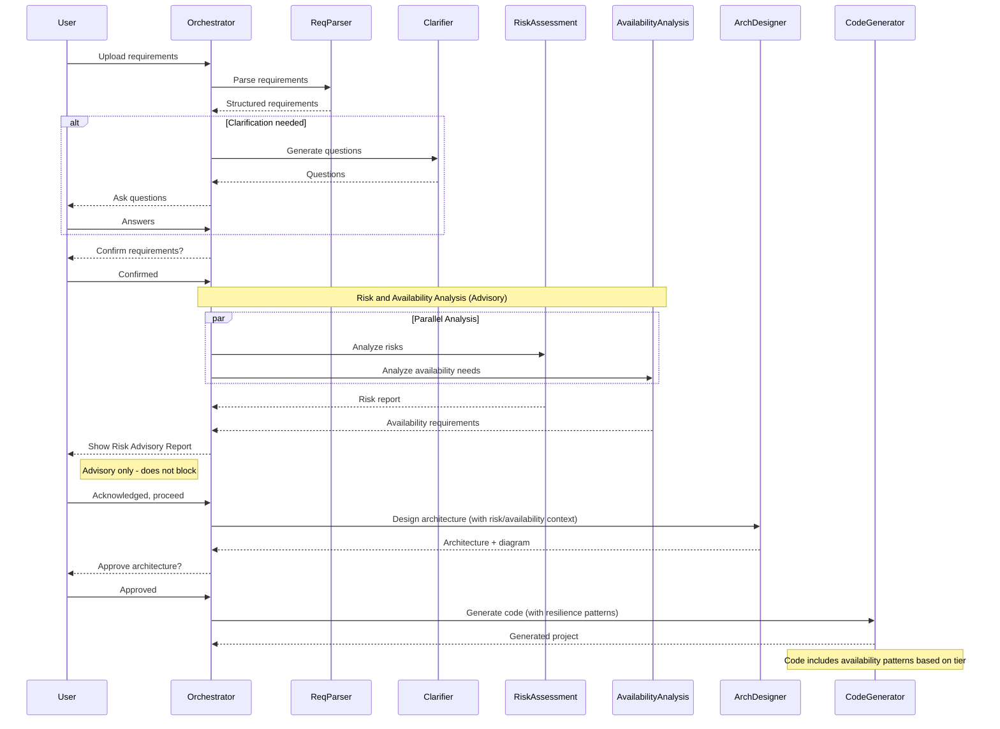

---

## 6. Agent Specifications

### 6.1 Orchestrator Agent

**Role:** Central coordinator that manages workflow state and delegates tasks to specialist agents.

| Property | Value |
|----------|-------|
| **Name** | `orchestrator_agent` |
| **Model** | `gemini-2.5-flash` |
| **Type** | Root Agent |
| **State** | Stateful (maintains session) |

**Responsibilities:**
1. Receive and route user requests
2. Maintain session state (current phase, collected data, artifacts)
3. Enforce state machine transitions
4. Require user confirmation at critical decision points
5. Handle errors and coordinate recovery
6. Aggregate results for user presentation

**Tools Available:**
| Tool | Type | Purpose |
|------|------|---------|
| `requirements_parser_agent` | AgentTool | Parse requirement documents |
| `clarification_agent` | AgentTool | Generate/process clarifying questions |
| `risk_assessment_agent` | AgentTool | Analyze operational, security, and availability risks |
| `availability_analysis_agent` | AgentTool | Determine availability tiers and resilience requirements |
| `compliance_checker_agent` | AgentTool | Check regulatory compliance (SOX, PCI-DSS, GDPR) |
| `architecture_designer_agent` | AgentTool | Design system architecture |
| `code_generator_agent` | AgentTool | Generate project code |
| `code_reviewer_agent` | AgentTool | Review code quality |
| `code_executor_agent` | AgentTool | Execute code in sandbox |
| `update_session_state` | Function | Update session state |
| `get_session_state` | Function | Retrieve session state |

**State Machine Rules:** (Defined in prompt - see Section 7)

---

### 6.2 Requirements Parser Agent

**Role:** Ingest and parse requirement documents into structured, actionable format.

| Property | Value |
|----------|-------|
| **Name** | `requirements_parser_agent` |
| **Model** | `gemini-2.5-flash` |
| **Type** | Sub-Agent (Specialist) |
| **State** | Stateless |

**Input:**
```json
{
  "document_uri": "gs://bucket/requirements.pdf",
  "document_type": "pdf|markdown|text",
  "raw_text": "Optional: direct text input"
}
```

**Output:**
```json
{
  "requirements": [
    {
      "id": "REQ-001",
      "type": "functional|non-functional",
      "category": "authentication|data|ui|integration|...",
      "description": "The system shall...",
      "priority": "must|should|could|wont",
      "ambiguity_score": 0.0-1.0,
      "ambiguity_reason": "Optional: why this is ambiguous"
    }
  ],
  "metadata": {
    "total_requirements": 15,
    "functional_count": 10,
    "non_functional_count": 5,
    "ambiguous_count": 3
  },
  "ambiguities": [
    {
      "requirement_id": "REQ-003",
      "issue": "Authentication method not specified",
      "suggested_question": "Should user authentication use OAuth2, JWT, or session-based auth?"
    }
  ]
}
```

**Tools:**
| Tool | Purpose |
|------|---------|
| `read_document_from_gcs` | Read files from Google Cloud Storage |
| `parse_pdf_document` | Extract text from PDF files |
| `parse_markdown_document` | Parse Markdown structure |

**Prompt Objectives:**
1. Extract ALL explicit requirements from the document
2. Categorize each requirement (functional vs non-functional)
3. Assign MoSCoW priority based on language cues
4. Flag ambiguous requirements with specific reasons
5. Generate suggested clarifying questions for ambiguities

---

### 6.3 Clarification Agent

**Role:** Generate targeted questions for ambiguous requirements and process user responses.

| Property | Value |
|----------|-------|
| **Name** | `clarification_agent` |
| **Model** | `gemini-2.5-flash` |
| **Type** | Sub-Agent (Specialist) |
| **State** | Stateless (state managed by orchestrator) |

**Input (Question Generation Mode):**
```json
{
  "mode": "generate_questions",
  "ambiguities": [...],
  "existing_requirements": [...],
  "context": "Project context or domain"
}
```

**Output (Question Generation Mode):**
```json
{
  "questions": [
    {
      "id": "Q-001",
      "requirement_id": "REQ-003",
      "question": "For user authentication, which method should be implemented?",
      "options": ["OAuth2 with Google", "Custom JWT", "Session-based", "Other"],
      "priority": 1,
      "follow_up_possible": true
    }
  ],
  "question_order": ["Q-001", "Q-002", "Q-003"]
}
```

**Input (Process Answer Mode):**
```json
{
  "mode": "process_answer",
  "question_id": "Q-001",
  "user_answer": "OAuth2 with Google",
  "original_requirement": {...},
  "follow_up_context": "..."
}
```

**Output (Process Answer Mode):**
```json
{
  "updated_requirement": {
    "id": "REQ-003",
    "description": "The system shall authenticate users via OAuth2 with Google as the provider",
    "ambiguity_score": 0.1
  },
  "follow_up_question": {
    "question": "Should other OAuth providers be supported in the future?",
    "options": ["Yes, plan for extensibility", "No, Google only"]
  },
  "clarification_complete": false
}
```

**Prompt Objectives:**
1. Generate precise, actionable questions
2. Provide sensible default options
3. Prioritize questions by impact on architecture
4. Support follow-up questions for incomplete answers
5. Know when clarification is sufficient

---

### 6.4 Architecture Designer Agent

**Role:** Design system architecture based on clarified requirements.

| Property | Value |
|----------|-------|
| **Name** | `architecture_designer_agent` |
| **Model** | `gemini-2.5-pro` (higher capability for design) |
| **Type** | Sub-Agent (Specialist) |
| **State** | Stateless |

**Input:**
```json
{
  "requirements": [...],
  "constraints": {
    "language": "python",
    "framework_preferences": ["fastapi", "flask"],
    "deployment_target": "docker|cloud_run|local"
  }
}
```

**Output:**
```json
{
  "architecture": {
    "pattern": "layered|microservices|monolith|serverless",
    "description": "High-level architecture description...",
    "components": [
      {
        "name": "API Gateway",
        "responsibility": "Handle incoming HTTP requests",
        "technology": "FastAPI",
        "interfaces": ["REST API"]
      },
      {
        "name": "Authentication Service",
        "responsibility": "Manage user authentication",
        "technology": "Google OAuth2",
        "interfaces": ["OAuth2 callback"]
      }
    ],
    "data_flow": "Description of how data flows...",
    "external_integrations": ["Google OAuth", "PostgreSQL"]
  },
  "tech_stack": {
    "language": "Python 3.11",
    "framework": "FastAPI",
    "database": "PostgreSQL",
    "authentication": "Google OAuth2",
    "containerization": "Docker"
  },
  "mermaid_diagram": "flowchart TB\n    ...",
  "file_structure": [
    "src/main.py",
    "src/api/routes.py",
    "src/services/auth.py",
    "requirements.txt",
    "Dockerfile"
  ]
}
```

**Tools:**
| Tool | Purpose |
|------|---------|
| `generate_diagram_from_mermaid` | Render Mermaid syntax to PNG image |
| `validate_tech_stack` | Check technology compatibility |

**Prompt Objectives:**
1. Choose appropriate architectural patterns
2. Design for the specific requirements (not over-engineer)
3. Select compatible, modern technologies
4. Produce clear Mermaid diagrams
5. Plan file structure for code generation

---

### 6.5 Code Generator Agent

**Role:** Generate complete, runnable project code based on approved architecture.

| Property | Value |
|----------|-------|
| **Name** | `code_generator_agent` |
| **Model** | `gemini-2.5-pro` |
| **Type** | Sub-Agent (Specialist) |
| **State** | Stateless |

**Input:**
```json
{
  "architecture": {...},
  "requirements": [...],
  "tech_stack": {...},
  "file_structure": [...],
  "coding_standards": {
    "style_guide": "PEP8",
    "documentation": "docstrings required",
    "error_handling": "explicit"
  }
}
```

**Output:**
```json
{
  "project_name": "my-generated-app",
  "files": [
    {
      "path": "src/main.py",
      "content": "...",
      "language": "python"
    },
    {
      "path": "requirements.txt",
      "content": "fastapi==0.109.0\nuvicorn==0.27.0\n...",
      "language": "text"
    },
    {
      "path": "Dockerfile",
      "content": "FROM python:3.11-slim\n...",
      "language": "dockerfile"
    },
    {
      "path": "README.md",
      "content": "# My Generated App\n...",
      "language": "markdown"
    }
  ],
  "setup_instructions": "1. Install dependencies...\n2. Set environment variables...",
  "run_command": "uvicorn src.main:app --reload"
}
```

**Tools:**
| Tool | Purpose |
|------|---------|
| `write_file` | Write generated files to disk/storage |
| `validate_syntax` | Check code syntax before output |

**Prompt Objectives:**
1. Generate COMPLETE, runnable code (not stubs)
2. Follow coding standards strictly
3. Include proper error handling
4. Add meaningful comments and docstrings
5. Generate all configuration files
6. Create useful README documentation

---

### 6.6 Code Reviewer Agent

**Role:** Quality gate to validate generated code meets standards.

| Property | Value |
|----------|-------|
| **Name** | `code_reviewer_agent` |
| **Model** | `gemini-2.5-flash` |
| **Type** | Sub-Agent (Specialist) |
| **State** | Stateless |

**Input:**
```json
{
  "files": [...],
  "requirements": [...],
  "style_guide": "PEP8",
  "review_criteria": [
    "syntax_correctness",
    "requirements_coverage",
    "security_best_practices",
    "error_handling",
    "code_quality"
  ]
}
```

**Output:**
```json
{
  "overall_status": "pass|fail",
  "score": 85,
  "reviews": [
    {
      "criterion": "syntax_correctness",
      "status": "pass",
      "details": "All files have valid Python syntax"
    },
    {
      "criterion": "security_best_practices",
      "status": "warning",
      "details": "API key should be loaded from environment variable, not hardcoded",
      "file": "src/config.py",
      "line": 15,
      "suggestion": "Use os.environ.get('API_KEY') instead"
    }
  ],
  "blocking_issues": [],
  "warnings": [
    {
      "file": "src/config.py",
      "issue": "Hardcoded API key",
      "severity": "medium"
    }
  ],
  "recommendations": [
    "Add type hints to function parameters",
    "Consider adding unit tests"
  ]
}
```

**Review Criteria:**
| Criterion | Weight | Description |
|-----------|--------|-------------|
| Syntax Correctness | Blocking | Code must parse without errors |
| Requirements Coverage | High | All requirements must be addressed |
| Security Best Practices | High | No hardcoded secrets, proper validation |
| Error Handling | Medium | Appropriate try/except blocks |
| Code Quality | Medium | Follows style guide, readable |
| Documentation | Low | Has docstrings and comments |

---

### 6.7 Code Executor Agent

**Role:** Execute generated code in a sandboxed environment and report results.

| Property | Value |
|----------|-------|
| **Name** | `code_executor_agent` |
| **Model** | `gemini-2.5-flash` |
| **Type** | Sub-Agent (Specialist) |
| **State** | Stateless |

**Input:**
```json
{
  "project_files": [...],
  "run_command": "python src/main.py",
  "timeout_seconds": 60,
  "test_inputs": [
    {"type": "http", "method": "GET", "path": "/health"}
  ],
  "expected_outputs": [
    {"type": "http", "status": 200}
  ]
}
```

**Output:**
```json
{
  "execution_status": "success|failure|timeout",
  "steps": [
    {
      "step": "create_sandbox",
      "status": "success",
      "duration_ms": 2500
    },
    {
      "step": "install_dependencies",
      "status": "success",
      "duration_ms": 15000,
      "output": "Successfully installed fastapi-0.109.0..."
    },
    {
      "step": "run_code",
      "status": "success",
      "duration_ms": 1000,
      "output": "Uvicorn running on http://0.0.0.0:8000"
    },
    {
      "step": "test_endpoint",
      "status": "success",
      "request": {"method": "GET", "path": "/health"},
      "response": {"status": 200, "body": {"status": "healthy"}}
    }
  ],
  "stdout": "...",
  "stderr": "...",
  "test_results": {
    "passed": 1,
    "failed": 0,
    "total": 1
  }
}
```

**Tools:**
| Tool | Purpose |
|------|---------|
| `create_docker_sandbox` | Spin up isolated Docker container |
| `install_dependencies` | Install packages in sandbox |
| `execute_command` | Run commands in sandbox |
| `send_http_request` | Test HTTP endpoints |
| `cleanup_sandbox` | Destroy sandbox after execution |

**Execution Strategy (POC vs Production):**

| Aspect | POC (MVP) | Production (Future) |
|--------|-----------|---------------------|
| Method | Local subprocess | Docker / Cloud Run Jobs |
| Isolation | Temp directory | Container isolation |
| Timeout | 60 seconds | Configurable |
| Cleanup | Delete temp dir | Destroy container |

**POC Implementation:**
```python
import subprocess
import tempfile
import os

def execute_in_subprocess(files: list, run_command: str, timeout: int = 60) -> dict:
    """Execute generated code in a temporary directory via subprocess."""
    with tempfile.TemporaryDirectory() as tmpdir:
        # Write all project files
        for f in files:
            filepath = os.path.join(tmpdir, f['path'])
            os.makedirs(os.path.dirname(filepath), exist_ok=True)
            with open(filepath, 'w') as fh:
                fh.write(f['content'])
        
        # Install dependencies
        req_file = os.path.join(tmpdir, 'requirements.txt')
        if os.path.exists(req_file):
            subprocess.run(['pip', 'install', '-r', req_file], 
                         cwd=tmpdir, timeout=timeout, capture_output=True)
        
        # Run the application
        result = subprocess.run(
            run_command.split(), cwd=tmpdir,
            timeout=timeout, capture_output=True, text=True
        )
        
        return {
            "exit_code": result.returncode,
            "stdout": result.stdout,
            "stderr": result.stderr,
            "success": result.returncode == 0
        }
```

**Production Implementation (Future):** Docker containers with full isolation (see Section 11.1)

---

### 6.8 Risk Assessment Agent (Banking)

**Role:** Analyze requirements for operational, security, and availability risks specific to banking environments.

| Property | Value |
|----------|-------|
| **Name** | `risk_assessment_agent` |
| **Model** | `gemini-2.5-pro` (higher capability for risk analysis) |
| **Type** | Sub-Agent (Specialist) |
| **State** | Stateless |

**Input:**
```json
{
  "requirements": [...],
  "project_context": {
    "domain": "banking",
    "criticality": "high",
    "data_classification": "confidential"
  }
}
```

**Output:**
```json
{
  "risk_report": {
    "overall_risk_level": "HIGH",
    "findings": [
      {
        "requirement_id": "REQ-003",
        "risk_category": "security",
        "risk_level": "CRITICAL",
        "impact": 5,
        "likelihood": 4,
        "score": 20,
        "description": "Card data handling without encryption",
        "mitigation": ["Implement tokenization", "Use HSM for key storage"]
      }
    ],
    "summary": {
      "critical": 1,
      "high": 3,
      "medium": 6,
      "low": 5
    }
  },
  "advisory_notes": "Proceed with enhanced security controls"
}
```

**Risk Categories Analyzed:**
| Category | Checks |
|----------|--------|
| **Operational** | Process gaps, human error potential, dependencies, data quality |
| **Security** | Data exposure, auth gaps, encryption needs, audit trails, fraud vectors |
| **Availability** | Single points of failure, scalability, RTO/RPO, bottlenecks |

---

### 6.9 Availability Analysis Agent (Banking)

**Role:** Determine availability tier requirements and resilience patterns for banking systems.

| Property | Value |
|----------|-------|
| **Name** | `availability_analysis_agent` |
| **Model** | `gemini-2.5-flash` |
| **Type** | Sub-Agent (Specialist) |
| **State** | Stateless |

**Input:**
```json
{
  "requirements": [...],
  "business_context": {
    "service_type": "payment_processing",
    "customer_impact": "direct",
    "regulatory_requirements": ["PCI-DSS", "SOX"]
  }
}
```

**Output:**
```json
{
  "availability_requirements": {
    "recommended_tier": 1,
    "target_availability": "99.99%",
    "rto_minutes": 5,
    "rpo_minutes": 1,
    "architecture_requirements": [
      "Active-active deployment",
      "Database replication with automatic failover",
      "Multi-region deployment",
      "Auto-scaling enabled"
    ],
    "resilience_patterns": [
      "circuit_breaker",
      "retry_with_backoff",
      "bulkhead_isolation",
      "graceful_degradation"
    ],
    "monitoring_requirements": [
      {"endpoint": "/health", "interval_seconds": 10},
      {"metric": "latency_p99", "threshold_ms": 200},
      {"metric": "error_rate", "threshold_percent": 0.1}
    ]
  }
}
```

**Availability Tiers:**
| Tier | Availability | Max Downtime/Year | Typical Use Case |
|------|--------------|-------------------|------------------|
| 1 | 99.99% | 52.6 minutes | Core banking, payments |
| 2 | 99.9% | 8.76 hours | Customer apps |
| 3 | 99.5% | 43.8 hours | Internal tools |
| 4 | 99% | 87.6 hours | Batch processing |

---

### 6.10 Compliance Checker Agent (Banking)

**Role:** Validate requirements against regulatory compliance frameworks.

| Property | Value |
|----------|-------|
| **Name** | `compliance_checker_agent` |
| **Model** | `gemini-2.5-pro` |
| **Type** | Sub-Agent (Specialist) |
| **State** | Stateless |

**Input:**
```json
{
  "requirements": [...],
  "applicable_frameworks": ["SOX", "PCI_DSS", "GDPR", "BASEL_III"]
}
```

**Output:**
```json
{
  "compliance_report": {
    "frameworks_checked": ["SOX", "PCI_DSS", "GDPR"],
    "status": "GAPS_FOUND",
    "compliant_count": 12,
    "gap_count": 3,
    "gaps": [
      {
        "framework": "PCI_DSS",
        "control": "Requirement 3.4 - Render PAN unreadable",
        "requirement_id": "REQ-003",
        "gap": "No encryption specified for stored card data",
        "remediation": "Implement AES-256 encryption or tokenization",
        "severity": "CRITICAL"
      }
    ],
    "recommendations": [
      "Add data encryption at rest requirements",
      "Include audit logging for data access",
      "Specify data retention policies"
    ]
  }
}
```

**Compliance Frameworks:**
| Framework | Scope | Key Controls |
|-----------|-------|--------------|
| **SOX** | Financial reporting | Audit trails, access controls, change management |
| **PCI-DSS** | Payment card data | Encryption, network segmentation, access logging |
| **GDPR** | Personal data (EU) | Consent, data minimization, right to erasure |
| **Basel III/IV** | Banking capital | Risk reporting, liquidity monitoring |

---

## 7. State Machine and Workflow

### 7.1 State Definitions

| State | Description | Entry Condition | Exit Condition |
|-------|-------------|-----------------|----------------|
| `NEW` | Initial state, document received | Document uploaded | Parsing started |
| `PARSING` | Extracting requirements | Orchestrator invokes parser | Parsing complete |
| `CLARIFYING` | Resolving ambiguities | Ambiguities detected | All clarified or user skips |
| `AWAITING_REQ_CONFIRMATION` | User confirms requirements | Clarification complete | User confirms |
| `RISK_ANALYSIS` | Analyzing risks and compliance | Requirements confirmed | Analysis complete |
| `RISK_ADVISORY` | Presenting risk report (advisory) | Analysis complete | User acknowledges |
| `DESIGNING` | Creating architecture | Risk acknowledged | Design complete |
| `AWAITING_ARCH_APPROVAL` | User approves architecture | Design presented | User approves |
| `GENERATING` | Writing code | Architecture approved | Code complete |
| `REVIEWING` | Quality check | Code generated | Review complete |
| `AWAITING_EXEC_CONFIRMATION` | User confirms execution | Review passed | User confirms |
| `EXECUTING` | Running code | Execution confirmed | Execution complete |
| `COMPLETE` | Workflow finished | Execution successful | N/A |

| `FAILED` | Error state | Any unrecoverable error | User restart |

> **Note:** Risk analysis runs in parallel (Risk Assessment, Availability Analysis, Compliance Check) and generates an advisory report. This does NOT block the workflow but informs the architecture design.

### 7.2 State Transition Diagram

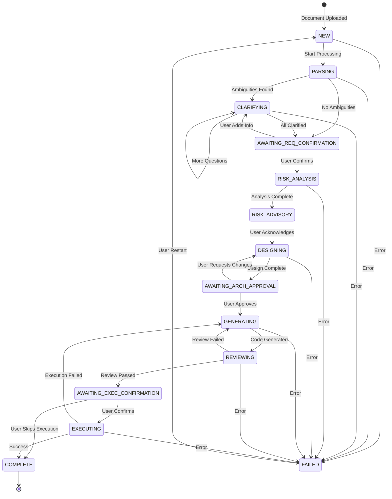

### 7.3 User Confirmation Gates

Critical points where the system MUST wait for user input:

| Gate | State | Question | Options |
|------|-------|----------|---------|
| **Requirements Gate** | `AWAITING_REQ_CONFIRMATION` | "I've extracted X requirements. Shall I proceed with architecture design?" | Proceed / Add More Info / Cancel |
| **Architecture Gate** | `AWAITING_ARCH_APPROVAL` | "Here's the proposed architecture [diagram]. Shall I generate the code?" | Approve / Request Changes / Cancel |
| **Execution Gate** | `AWAITING_EXEC_CONFIRMATION` | "Code has been generated and reviewed. Shall I execute it?" | Execute / Download Only / Cancel |

### 7.4 Error Recovery Strategies

| Error Type | Recovery Strategy |
|------------|-------------------|
| Document parsing failure | Ask user for different format or manual text input |
| Clarification timeout | Proceed with assumptions, flag in output |
| Architecture generation failure | Retry with simplified requirements |
| Code generation failure | Retry with more explicit prompts |
| Code review failure | Auto-fix if possible, otherwise regenerate |
| Execution failure | Report error, suggest fixes, offer regeneration |

---

## 8. Data Models

### 8.1 Session State

```python
@dataclass
class SessionState:
    session_id: str
    current_state: WorkflowState
    created_at: datetime
    updated_at: datetime
    
    # Document data
    document_uri: Optional[str]
    document_content: Optional[str]
    
    # Requirements data
    requirements: List[Requirement]
    ambiguities: List[Ambiguity]
    clarification_history: List[ClarificationExchange]
    
    # Architecture data
    architecture: Optional[Architecture]
    architecture_diagram_url: Optional[str]
    
    # Code data
    generated_files: List[GeneratedFile]
    review_results: Optional[ReviewResults]
    
    # Execution data
    execution_results: Optional[ExecutionResults]
    
    # Metadata
    error_log: List[ErrorEntry]
    user_preferences: Dict[str, Any]
```

### 8.2 Requirement Model

```python
@dataclass
class Requirement:
    id: str                          # e.g., "REQ-001"
    type: RequirementType            # FUNCTIONAL | NON_FUNCTIONAL
    category: str                    # authentication, data, ui, etc.
    description: str                 # The requirement text
    priority: Priority               # MUST | SHOULD | COULD | WONT
    source_location: str             # Where in document this came from
    ambiguity_score: float           # 0.0 (clear) to 1.0 (very ambiguous)
    ambiguity_reason: Optional[str]  # Why it's ambiguous
    clarified: bool                  # Has this been clarified?
    clarification_notes: str         # Notes from clarification
```

### 8.3 Architecture Model

```python
@dataclass
class Architecture:
    pattern: ArchitecturePattern     # LAYERED | MICROSERVICES | etc.
    description: str
    components: List[Component]
    data_flow: str
    tech_stack: TechStack
    file_structure: List[str]
    mermaid_syntax: str
    
@dataclass
class Component:
    name: str
    responsibility: str
    technology: str
    interfaces: List[str]
    dependencies: List[str]
    
@dataclass
class TechStack:
    language: str
    language_version: str
    framework: str
    database: Optional[str]
    authentication: Optional[str]
    containerization: str
    additional: Dict[str, str]
```

### 8.4 Generated File Model

```python
@dataclass
class GeneratedFile:
    path: str                        # Relative path in project
    content: str                     # File content
    language: str                    # python, dockerfile, yaml, etc.
    purpose: str                     # Brief description of file's purpose
    
@dataclass
class GeneratedProject:
    name: str
    files: List[GeneratedFile]
    setup_instructions: str
    run_command: str
    test_command: Optional[str]
```

### 8.5 Execution Results Model

```python
@dataclass
class ExecutionResults:
    status: ExecutionStatus          # SUCCESS | FAILURE | TIMEOUT
    total_duration_ms: int
    steps: List[ExecutionStep]
    stdout: str
    stderr: str
    test_results: Optional[TestResults]
    artifacts: List[str]             # URLs to any generated artifacts
    
@dataclass
class ExecutionStep:
    name: str
    status: StepStatus
    duration_ms: int
    output: str
    error: Optional[str]
```

---

## 9. Tools and Integrations

### 9.1 Document Tools

| Tool | Function | Input | Output |
|------|----------|-------|--------|
| `read_document_from_gcs` | Read file from Cloud Storage | `uri: str` | `content: str` |
| `parse_pdf_document` | Extract text from PDF | `content: bytes` | `text: str, pages: int` |
| `parse_markdown_document` | Parse Markdown structure | `content: str` | `sections: List[Section]` |

**Implementation Notes:**
- Use `google-cloud-storage` Python library for GCS
- Use `PyPDF2` or `pdfplumber` for PDF parsing
- Use `markdown-it-py` for Markdown parsing

### 9.2 Diagram Tools

| Tool | Function | Input | Output |
|------|----------|-------|--------|
| `generate_diagram_from_mermaid` | Render Mermaid to image | `mermaid_syntax: str` | `image_url: str` |
| `validate_mermaid_syntax` | Check Mermaid validity | `syntax: str` | `valid: bool, errors: List[str]` |

**Implementation Options:**
1. **Mermaid CLI:** Run `mmdc` in subprocess
2. **Kroki API:** External rendering service (https://kroki.io)
3. **Mermaid.ink:** Free online rendering API

**Recommended:** Kroki API for simplicity in POC

### 9.3 File Tools

| Tool | Function | Input | Output |
|------|----------|-------|--------|
| `write_file_to_gcs` | Write file to Cloud Storage | `path: str, content: str` | `uri: str` |
| `create_project_archive` | Zip project files | `files: List[File]` | `archive_uri: str` |
| `validate_file_syntax` | Check syntax by language | `content: str, lang: str` | `valid: bool, errors: List` |

### 9.4 Sandbox Tools

| Tool | Function | Input | Output |
|------|----------|-------|--------|
| `create_docker_sandbox` | Create isolated container | `image: str, limits: ResourceLimits` | `sandbox_id: str` |
| `copy_files_to_sandbox` | Copy project to container | `sandbox_id: str, files: List[File]` | `success: bool` |
| `execute_in_sandbox` | Run command in container | `sandbox_id: str, command: str` | `stdout, stderr, exit_code` |
| `test_http_endpoint` | Send HTTP request to sandbox | `sandbox_id: str, request: HttpRequest` | `response: HttpResponse` |
| `destroy_sandbox` | Clean up container | `sandbox_id: str` | `success: bool` |

**Implementation:**
- Use Docker SDK for Python (`docker` package)
- Create containers with resource limits
- Mount project files as volumes
- Network isolation with custom bridge

---

## 10. Technology Stack

### 10.1 Core Technologies

| Layer | Technology | Version | Purpose |
|-------|------------|---------|---------|
| **Multi-Agent Framework** | Google ADK | Latest | Agent orchestration |
| **LLM** | Gemini 2.5 Flash | 2.5 | General agent reasoning |
| **LLM (Complex Tasks)** | Gemini 2.5 Pro | 2.5 | Architecture/code generation |
| **Language** | Python | 3.11+ | Implementation language |
| **Package Manager** | Poetry | 1.7+ | Dependency management |

### 10.2 Google Cloud Services

| Service | Purpose | POC | Production |
|---------|---------|-----|------------|
| **Vertex AI** | Gemini API + RAG Corpus | Required | Required |
| **Cloud Storage** | Document and artifact storage | Required | Required |
| **Secret Manager** | API key storage | Recommended | Required |
| **BigQuery** | Vector search for historical data | Optional | Required |
| **Cloud Run** | Sandbox execution | Not needed | Required |
| **Cloud Build** | Container builds | Not needed | Required |

### 10.3 Third-Party Libraries

| Library | Purpose |
|---------|---------|
| `google-adk` | Agent Development Kit |
| `google-cloud-aiplatform` | Vertex AI client |
| `google-cloud-storage` | GCS client |
| `pydantic` | Data validation |
| `PyPDF2` | PDF parsing |
| `docker` | Container management |
| `httpx` | HTTP client for testing |
| `rich` | CLI formatting |

### 10.4 Development Tools

| Tool | Purpose |
|------|---------|
| `pytest` | Testing |
| `black` | Code formatting |
| `ruff` | Linting |
| `mypy` | Type checking |

---

## 11. Security Considerations

### 11.1 Code Execution Security

| Risk | Mitigation |
|------|------------|
| **Malicious code execution** | All code runs in isolated Docker containers |
| **Resource exhaustion** | CPU, memory, and time limits enforced |
| **Network attacks** | Containers have no external network access |
| **Filesystem access** | No host filesystem mounted |
| **Container escape** | Use rootless containers, drop capabilities |

**Docker Security Configuration:**
```python
container_config = {
    "mem_limit": "512m",
    "cpu_period": 100000,
    "cpu_quota": 50000,  # 50% of one CPU
    "network_mode": "none",
    "read_only": True,
    "security_opt": ["no-new-privileges:true"],
    "cap_drop": ["ALL"],
}
```

### 11.2 Data Security

| Risk | Mitigation |
|------|------------|
| **Sensitive data in documents** | Documents processed in-memory, not persisted |
| **Generated code contains secrets** | Code reviewer checks for hardcoded secrets |
| **Session data leakage** | Sessions isolated, auto-expire after 24h |

### 11.3 API Security

| Risk | Mitigation |
|------|------------|
| **API key exposure** | Keys stored in Secret Manager, never in code |
| **Rate limiting** | Implement request throttling |
| **Input validation** | Validate all inputs before processing |

### 11.4 LLM Security

| Risk | Mitigation |
|------|------------|
| **Prompt injection** | Input sanitization, structured prompts |
| **Data exfiltration** | Output validation before returning to user |
| **Harmful content generation** | Gemini's built-in safety filters |

---

## 12. Deployment Architecture

### 12.1 GCP Project Setup (Required for POC)

**GCP Services to Enable:**

| Service | API to Enable | Purpose | Required |
|---------|---------------|---------|----------|
| Vertex AI | `aiplatform.googleapis.com` | Gemini API + RAG | Yes |
| Cloud Storage | `storage.googleapis.com` | Document storage | Yes |
| BigQuery | `bigquery.googleapis.com` | Vector search (future) | No (future) |
| Cloud Build | `cloudbuild.googleapis.com` | Container builds (future) | No (future) |
| Secret Manager | `secretmanager.googleapis.com` | API key storage | Recommended |

**Setup Script (`setup_environment.sh`):**

```bash
#!/bin/bash
set -e

# Load environment variables
source .env

echo "Phase 1: Enabling GCP APIs..."
gcloud services enable aiplatform.googleapis.com --project=$GOOGLE_CLOUD_PROJECT
gcloud services enable storage.googleapis.com --project=$GOOGLE_CLOUD_PROJECT

echo "Phase 2: Creating GCS bucket..."
gsutil mb -p $GOOGLE_CLOUD_PROJECT -l $GOOGLE_CLOUD_LOCATION \
    gs://$GOOGLE_CLOUD_STORAGE_BUCKET/ 2>/dev/null || echo "Bucket already exists"

echo "Phase 3: Uploading sample requirement documents..."
gsutil cp data/sample_requirements/* gs://$GOOGLE_CLOUD_STORAGE_BUCKET/requirements/

echo "Phase 4: Setting up Vertex AI RAG Corpus..."
python3 scripts/setup_rag_corpus.py

echo "Setup complete!"
```

**Environment Variables (`.env`):**

```bash
# Required
GOOGLE_CLOUD_PROJECT=your-gcp-project-id
GOOGLE_CLOUD_LOCATION=us-central1
GOOGLE_CLOUD_STORAGE_BUCKET=your-unique-bucket-name

# Auto-populated by setup script
RAG_CORPUS_NAME=

# Optional
BQ_PROJECT_ID=your-gcp-project-id
BQ_DATASET_ID=requirements_db
```

**IAM Permissions Required:**
- `Vertex AI User` - For Gemini API and RAG
- `Storage Object Admin` - For GCS read/write
- `BigQuery User` - For vector search (if used)

**Authentication:**
```bash
# One-time setup
gcloud auth application-default login
gcloud config set project your-gcp-project-id
```

### 12.2 Local Development (POC)

```
┌─────────────────────────────────────────────────────────────────┐
│                     Developer Machine                           │
│  ┌─────────────┐  ┌─────────────┐  ┌─────────────────────────┐ │
│  │   ADK CLI   │  │   Agents    │  │   Docker (Sandboxes)    │ │
│  │   adk web   │  │             │  │  ┌───────┐ ┌───────┐   │ │
│  └──────┬──────┘  └──────┬──────┘  │  │Sandbox│ │Sandbox│   │ │
│         │                │         │  └───────┘ └───────┘   │ │
│         └────────┬───────┘         └─────────────────────────┘ │
│                  │                                              │
└──────────────────┼──────────────────────────────────────────────┘
                   │
                   ▼
         ┌─────────────────┐
         │  Google Cloud   │
         │  - Vertex AI    │
         │  - GCS          │
         └─────────────────┘
```

**Setup Commands:**
```bash
# Install dependencies
poetry install

# Configure GCP
gcloud auth application-default login
export GOOGLE_CLOUD_PROJECT=your-project-id

# Run locally
adk web
```

### 12.3 Production Deployment (Future)

```
┌─────────────────────────────────────────────────────────────────────────────┐
│                           Google Cloud Platform                              │
│                                                                              │
│  ┌─────────────────────┐      ┌─────────────────────┐                       │
│  │    Cloud Run        │      │    Vertex AI        │                       │
│  │  (Agent Service)    │◄────►│    (Gemini API)     │                       │
│  └──────────┬──────────┘      └─────────────────────┘                       │
│             │                                                                │
│             ▼                                                                │
│  ┌─────────────────────┐      ┌─────────────────────┐                       │
│  │   Cloud Run Jobs    │      │   Cloud Storage     │                       │
│  │  (Code Sandboxes)   │      │  (Documents/Code)   │                       │
│  └─────────────────────┘      └─────────────────────┘                       │
│                                                                              │
└─────────────────────────────────────────────────────────────────────────────┘
```

---

## 13. Implementation Roadmap

### MVP POC Scope

The POC targets a **live demo** on GCP with the following scope:

| In Scope (MVP) | Out of Scope (Future) |
|-----------------|----------------------|
| Text/Markdown document input | PDF parsing |
| Vertex AI RAG for document processing | BigQuery vector search |
| Ambiguity detection + clarification loop | Multi-language support |
| Risk analysis advisory report | Persistent memory across sessions |
| Mermaid diagram generation | Custom frontend UI |
| Python code generation | Multi-service architectures |
| Code review agent | Production deployment scripts |
| Subprocess code execution | Docker/Cloud Run sandboxing |
| ADK Web UI for demo | Custom web frontend |

### Phase 1: GCP Setup + Foundation (Week 1)

**Deliverables:**
- GCP project configured (Vertex AI, Cloud Storage, IAM)
- Project structure matching ADK conventions
- Basic orchestrator agent with state machine prompt
- Session state management via ADK `InMemorySessionService`
- `setup_environment.sh` script to provision cloud resources

**Acceptance Criteria:**
- `adk web` starts and shows the agent in the dropdown
- Orchestrator responds to basic greetings
- GCP services accessible from local machine

### Phase 2: Requirements Parsing + Clarification (Week 2)

**Deliverables:**
- Requirements Parser agent with GCS document reading
- Vertex AI RAG corpus for document storage
- Clarification Agent with question generation
- User confirmation gates (requirements gate)

**Acceptance Criteria:**
- Upload a Markdown file to GCS, agent parses and extracts requirements
- Ambiguities correctly identified and flagged
- Clarifying questions generated and answers processed
- Multi-turn clarification works

### Phase 3: Risk Analysis + Banking Agents (Week 3)

**Deliverables:**
- Risk Assessment Agent (operational, security, availability)
- Availability Analysis Agent (tier determination)
- Compliance Checker Agent (SOX, PCI-DSS, GDPR)
- Advisory report generation

**Acceptance Criteria:**
- Risk report generated for banking requirements
- Compliance gaps identified correctly
- Availability tier recommended based on service type
- Advisory report presented without blocking workflow

### Phase 4: Architecture + Code Generation (Week 4)

**Deliverables:**
- Architecture Designer agent with Mermaid diagrams
- Diagram rendering via Kroki API
- Code Generator agent (Python projects)
- Code Reviewer agent with quality checks

**Acceptance Criteria:**
- Architecture diagram rendered and shown to user
- Complete Python project generated (FastAPI, etc.)
- Code reviewer catches security and quality issues
- User can approve/reject at each gate

### Phase 5: Execution + End-to-End Demo (Week 5)

**Deliverables:**
- Code Executor agent using local subprocess (POC)
- End-to-end workflow testing with sample requirements
- Demo script and sample banking requirement documents
- Error handling and recovery

**Acceptance Criteria:**
- Generated code executes successfully via subprocess
- Full workflow runs end-to-end: Upload -> Parse -> Clarify -> Risk -> Design -> Generate -> Review -> Execute
- Demo runs cleanly on `adk web`

### Phase 6: Polish + Demo Preparation (Week 6)

**Deliverables:**
- Error handling improvements
- 2-3 pre-built demo scenarios (banking use cases)
- Documentation and README
- Demo recording or live walkthrough preparation

---

## 14. Appendices

### Appendix A: Sample Orchestrator Prompt

```
You are 'CodeForge', the master orchestrator for a requirements-to-code multi-agent system.
You MUST follow a strict state machine and WAIT for user confirmation at specific points.

**CRITICAL EXECUTION RULES:**
- ALWAYS check session state for current workflow state FIRST
- Follow state machine EXACTLY - never skip states
- When you ask a question, END YOUR RESPONSE and wait for user input
- Never continue past a STOP point in the same response

**State Machine:**

**State: NEW**
1. Acknowledge document receipt
2. Call `requirements_parser_agent` with the document
3. Update state to PARSING

**State: PARSING**
1. Review parser output
2. If ambiguities found → call `clarification_agent`, set state to CLARIFYING
3. If no ambiguities → set state to AWAITING_REQ_CONFIRMATION
4. Present requirements summary to user

**State: CLARIFYING**
1. Present questions from clarification agent to user
2. STOP and wait for user response
3. On user response → call `clarification_agent` to process answer
4. If more questions → repeat
5. If complete → set state to AWAITING_REQ_CONFIRMATION

**State: AWAITING_REQ_CONFIRMATION**
1. Ask user: "Requirements are ready. Shall I proceed?"
2. STOP and wait for user response
3. On confirmation → set state to RISK_ANALYSIS
4. On rejection → return to CLARIFYING

**State: RISK_ANALYSIS**
1. Call `risk_assessment_agent`, `availability_analysis_agent`, `compliance_checker_agent`
2. Compile advisory report
3. Present report to user
4. Set state to RISK_ADVISORY

**State: RISK_ADVISORY**
1. This is ADVISORY ONLY - do NOT block
2. User acknowledges report → set state to DESIGNING
3. Inform user: "Risk report noted. Proceeding to architecture design."

**State: DESIGNING**
1. Call `architecture_designer_agent` (pass risk context for informed design)
2. Call `generate_diagram_from_mermaid` with the Mermaid syntax
3. Present architecture + diagram to user
4. Set state to AWAITING_ARCH_APPROVAL

... [continued for GENERATING, REVIEWING, EXECUTING, COMPLETE]

**RESPONSE ENDING LOGIC:**
- After asking ANY question: Stop writing, end your response
- Do NOT continue with hypothetical scenarios
- Wait for actual user response
```

### Appendix B: Sample Requirement Document

```markdown
# Project: Task Management API

## Overview
Build a REST API for managing tasks with user authentication.

## Requirements

### Authentication
- Users should be able to sign up and log in
- Use secure authentication method

### Tasks
- Users can create, read, update, and delete tasks
- Each task has a title, description, due date, and status
- Tasks belong to the user who created them

### API
- RESTful endpoints
- JSON request/response format
- Proper error handling

### Non-Functional
- Response time under 200ms
- Handle 100 concurrent users
```

### Appendix C: Expected Output for Sample

**Extracted Requirements:**
| ID | Type | Description | Priority | Ambiguous |
|----|------|-------------|----------|-----------|
| REQ-001 | Functional | User signup capability | Must | No |
| REQ-002 | Functional | User login capability | Must | No |
| REQ-003 | Functional | Secure authentication | Must | Yes - method unspecified |
| REQ-004 | Functional | CRUD operations for tasks | Must | No |
| REQ-005 | Functional | Task fields: title, description, due date, status | Must | No |
| REQ-006 | Functional | Tasks owned by creator | Must | No |
| REQ-007 | Non-functional | Response time < 200ms | Should | No |
| REQ-008 | Non-functional | 100 concurrent users | Should | No |

**Clarifying Questions:**
1. "For secure authentication (REQ-003), which method should be used?"
   - Options: JWT tokens, OAuth2, Session-based cookies

**Generated Architecture:**
- Pattern: Layered (API → Service → Repository)
- Tech Stack: Python, FastAPI, SQLite (for POC), JWT auth
- Components: Auth module, Task module, Database layer

---

## Document Revision History

| Version | Date | Author | Changes |
|---------|------|--------|---------|
| 1.0 | 2026-02-04 | Tabrez Shaik | Initial draft |
| 1.1 | 2026-02-04 | Tabrez Shaik | Added: Implementation Deep Dive (Section 5), Banking risk/compliance/availability agents, GCP project setup, POC-scoped roadmap, Gemini 2.5 model updates |

---

## Approval

| Role | Name | Signature | Date |
|------|------|-----------|------|
| Architect | | | |
| Tech Lead | | | |
| Product Owner | | | |
